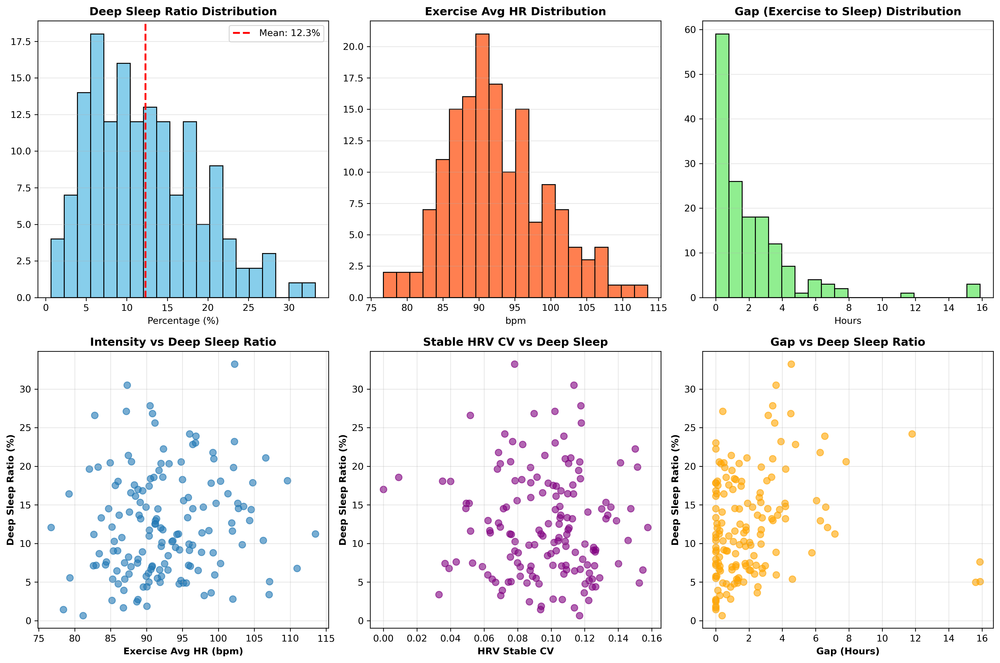
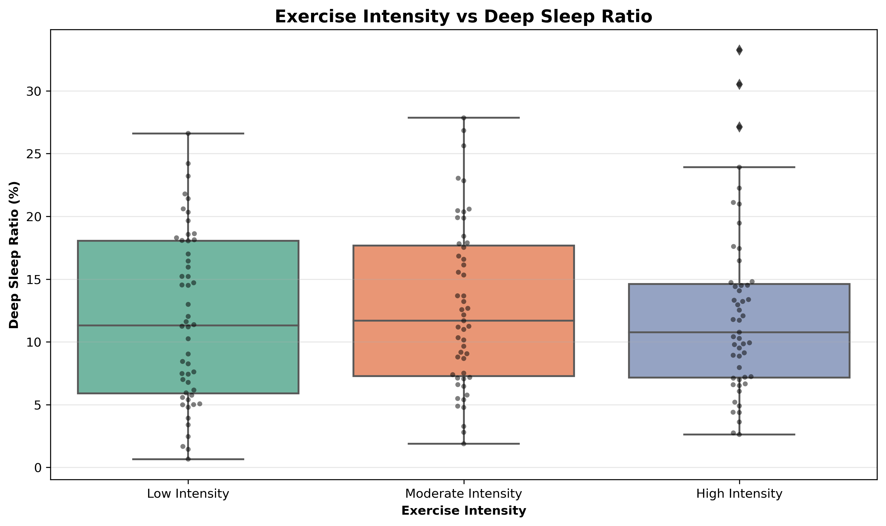
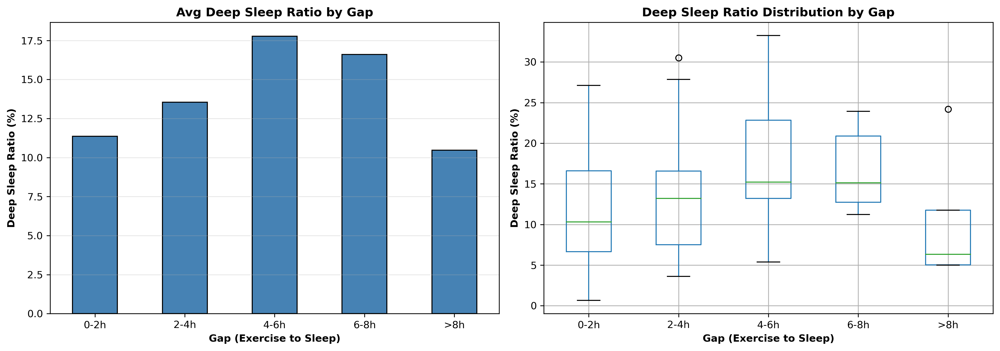
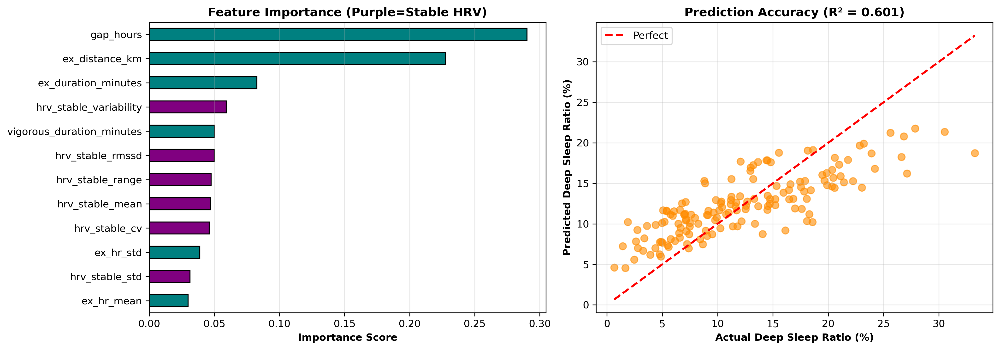

# 運動特徵對深度睡眠的影響分析
### Exercise Pattern Analysis on Deep Sleep Quality


---

## 專案簡介

本專案以 Garmin 穿戴裝置收集的真實世界生理數據為基礎，探討運動模式（包含運動強度、持續時間、運動與入睡之時間間隔等特徵）對深度睡眠比例的影響。透過穩定期心率變異（HRV）特徵工程、統計假設檢定與多種機器學習迴歸模型，最終以 Random Forest（R²=0.601）為最佳模型，識別出 `gap_hours`（運動至入睡間隔）為最具預測力的單一特徵。

---

## 研究問題

- 不同運動強度是否對深度睡眠時間具有顯著影響？
- 運動量是否存在有利於深度睡眠的適當範圍？
- 運動與入睡之時間間隔，是否為影響深度睡眠的重要因子？
- 在多項運動指標中，哪些變數對深度睡眠的解釋力與預測力最高？

---

## 資料集

資料來自 **Garmin Health API**，為研究所學長姐穿戴裝置所記錄之真實生理數據，由課堂教授提供進行分析，共包含三個 CSV 檔案。**原始資料因隱私保護不公開於此 repo**，詳細欄位格式請參閱 [data/README.md](data/README.md)。

| 檔案名稱 | 筆數 | 說明 |
|---|---|---|
| `dailies.csv` | 6,047 筆 | 每日活動摘要，含步數、心率、強度時長、靜止心率等 |
| `sleeps.csv` | 3,976 筆 | 睡眠紀錄，含深度睡眠、淺層睡眠、REM 時長 |
| `dailies_heartrate.csv` | 約 2,000 萬筆 | 詳細心率時間序列，每 15 秒一筆 |

---

## 研究方法

本研究資料由課堂教授提供，來源為研究所學長姐穿戴 Garmin 裝置所記錄的生理數據，透過 Garmin Health API 匯出每日活動摘要、睡眠紀錄與詳細心率時間序列，資料涵蓋約兩年的真實世界觀測。

在特徵工程方面，針對心率變異（HRV）採用「穩定期」設計——排除每次運動前後各 20% 的暖身與收操段，僅分析中間 60% 的穩定運動期，計算 RMSSD、變異係數（CV）、標準差及心率範圍等指標，以更精確反映運動中的持續生理負荷。運動強度以個人靜止心率為基準動態劃分：超過靜止心率 20 bpm 為中等強度、超過 40 bpm 為高強度。核心自變數包括 `gap_hours`（運動至入睡間隔）、`ex_hr_mean`、`hr_elevation`、`ex_duration_minutes`、`vigorous_ratio`、`intensity_load` 及 `ex_distance_km`；依變數為 `deepSleepRatio`（深度睡眠佔總睡眠時間百分比）。

統計分析依序進行描述性統計與分布型態檢驗、皮爾森積差相關分析，以及單因子變異數分析（One-way ANOVA），比較不同強度組別間深度睡眠比例的差異是否顯著。機器學習階段比較了 Ridge Regression、Lasso Regression、Random Forest 與 Gradient Boosting 四種模型，結合訓練測試分割與 k 折交叉驗證，以測試集 R² 與 CV R² 共同評選最佳模型。

---

## 主要發現

- 深度睡眠比例平均 **12.3%**，呈右偏分布，個體間變異明顯
- 運動至入睡間隔 **4–6 小時**對應最高深度睡眠比例（平均 **17.8%**），間隔過短（< 2h）或過長（> 8h）皆使比例下降
- `gap_hours` 為最重要預測特徵（重要性分數 ≈ **0.29**），其次為 `ex_distance_km`（≈ 0.23）
- 最佳模型：**Random Forest**，R² = **0.601**，可解釋約 60% 的深度睡眠比例變異

---

## 結果圖表

### 探索性分析



各變數分布與散點圖：深度睡眠比例分布、運動平均心率分布、運動至入睡間隔分布，以及各特徵與深度睡眠比例的散點關係。

### 運動強度分析



低、中、高強度組別與深度睡眠比例箱型圖：以個人靜止心率為基準動態分組，比較各強度組別的深度睡眠比例分布。

### 時間間隔分析



運動至入睡間隔與深度睡眠比例關係：依 0–2h、2–4h、4–6h、6–8h、>8h 分組，呈現各區間平均值與分布。

### 模型結果



特徵重要性排序與預測精度（R²=0.601）：各特徵對 Random Forest 模型的貢獻度，以及預測值與實際值的對照。

---

## 環境安裝

```bash
pip install -r requirements.txt
```

Python 3.10 以上版本

---

## 使用說明

1. 將三個 CSV 資料檔放入 `./巨量資料概論/` 資料夾
   （資料格式請參閱 [data/README.md](data/README.md)）
2. 安裝套件：`pip install -r requirements.txt`
3. 開啟 Jupyter Notebook：`jupyter notebook`
4. 執行 `巨量期末專案_第三組.ipynb`
   - 建議記憶體：8GB 以上（心率資料約 2,000 萬筆）
   - 完整執行時間：約 10–30 分鐘（依硬體而定）

---

> 本專案源自東吳大學資料科學系課程期末報告（2025）。
